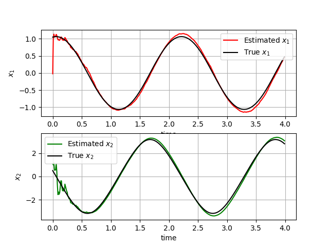
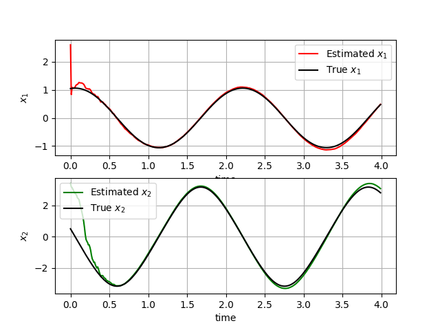
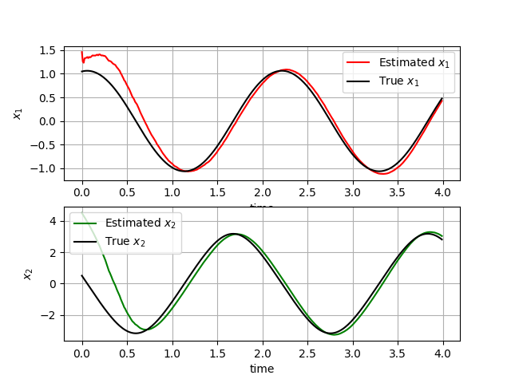
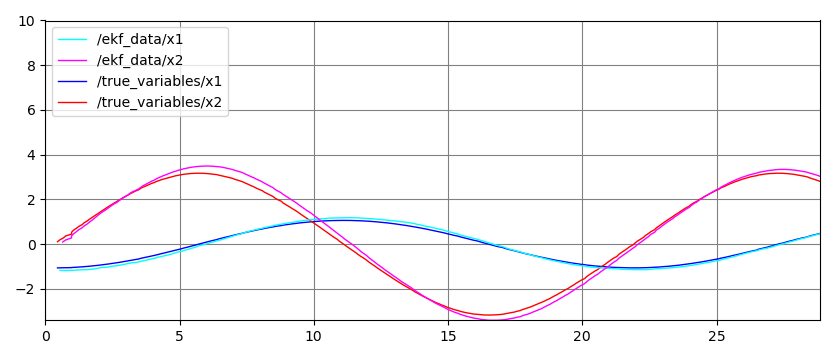
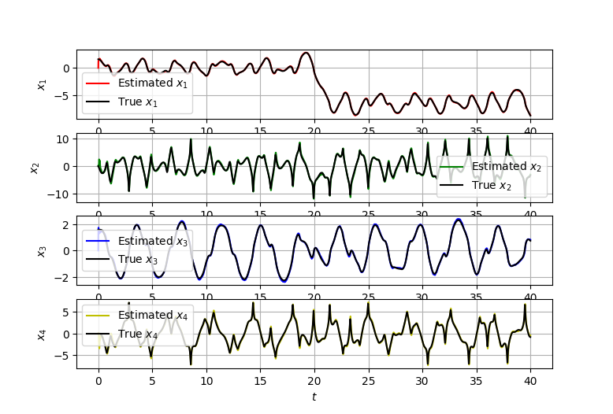

# Extended Kalman Filter
- The `efk_singlependulum` folder contains the files for the single pendulum EKF simulation.
- The `unuactuated_pendulum` folder contains the files for the single pendulum ROS simulation.
- The `ekf_doublependulum` folder contains the files for the double pendulum EKF simulation.

## Single Pendulum
The simulation is run for 400 timesteps. To run the simulation execute the `ekf_singlependulum/main.py` file. 
The system was tested using three different covariance EKF $\mathbf{R}$ matrix, in particular with values 0.05, 1 and 10. Following are the results obtained.

    
    <em>EKF results for R=0.05</em>

    
    <em>EKF results for R=1</em>

    
    <em>EKF results for R=10</em>

## Single Pendulum - ROS
To run the ROS simulation the following steps need to be followed:
- Execute the `roscore` command to start the master node.
- Run the `launch/ekf.launch` launch file to start the simulation, which starts the following ROS nodes:
    - `pendulum.py` simulated the behavior of the real pendulum system, that generates the real state and sends it to the sensor node via the `true_variables` topic.
    - `sensor.py` receives the real data from the pendulum via the `true_variables` topic. It then adds noise to the measurement to simulate a real behavior and sends it to the ekf node via the `sensor_data` topic.
    - `ekf.py` receives the noisy data from the sensor via the `sensor_data` topic. It then runs the EKF algorithm and outputs the estimated state, sending it to the `ekf_data` topic.

- To plot the system states and the EKF results use the `rqt_plot` command.

    
    <em>EKF ROS results</em>

- To plot the ROS nodes and topics use the `rqt_graph` command.

    
    <em>ROS nodes and topics structure</em>

## Double Pendulum
The simulation is run for 4000 timesteps. To run the simulation execute the `ekf_doublependulum/main.py` file.

    
    <em>EKF double pendulum results</em>

